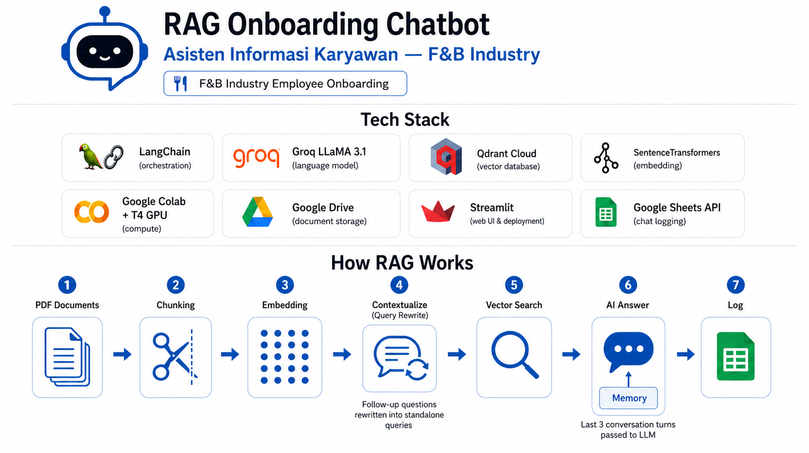

# 🤖 RAG Onboarding Chatbot — F&B Industry



> Final Project — AI Bootcamp  
> Retrieval-Augmented Generation (RAG) untuk onboarding karyawan baru di industri F&B

---

## 📌 Deskripsi Proyek

Chatbot berbasis RAG yang dirancang untuk membantu karyawan baru memahami dokumen internal perusahaan secara interaktif. Sistem ini memungkinkan pengguna mengajukan pertanyaan dalam bahasa natural dan mendapatkan jawaban yang relevan berdasarkan dokumen resmi perusahaan — tanpa perlu membaca seluruh dokumen secara manual.

Proyek ini menggunakan tiga perusahaan F&B sebagai studi kasus, masing-masing dengan dataset dokumen internal yang terpisah.

---

## 🏢 Dataset

| Perusahaan | Brand | Dokumen |
|---|---|---|
| PT Sumoda Tama Berkah | Susu Mbok Darmi | 11 PDF |
| PT Sambal Cobek Indonesia | Pecel Lele Lala | 11 PDF |
| Yeyeti Katering & Peyek Yeyeti | Katering Yeyeti | 11 PDF |

**Total: 33 dokumen PDF · 103 halaman · 444 chunks**

---

## ⚙️ Tech Stack

| Komponen | Teknologi |
|---|---|
| Orchestration | LangChain |
| Language Model | Groq — LLaMA 3.1 8B Instant |
| Embedding Model | `paraphrase-multilingual-MiniLM-L12-v2` |
| Vector Database | Qdrant Cloud |
| Compute | Google Colab + T4 GPU |
| Document Storage | Google Drive |
| Evaluation | ROUGE Score |

---

## 🔄 Cara Kerja RAG Pipeline

```
PDF Dokumen → Chunking → Embedding → Qdrant Cloud
                                           ↓
Pertanyaan User → Embedding → Vector Search → Context + Pertanyaan → LLM → Jawaban
```

1. **Load** — Dokumen PDF dibaca menggunakan PyMuPDF
2. **Chunking** — Dokumen dipecah menjadi potongan 500 karakter dengan overlap 50 karakter
3. **Embedding** — Tiap chunk dikonversi menjadi vektor menggunakan SentenceTransformers
4. **Store** — Vektor disimpan permanen di Qdrant Cloud
5. **Retrieve** — Pertanyaan user di-embed, lalu dicari chunk paling relevan via cosine similarity
6. **Generate** — Context + pertanyaan dikirim ke Groq LLaMA 3.1 untuk menghasilkan jawaban

---

## 📊 Hasil Evaluasi ROUGE Score

| Perusahaan | ROUGE-1 | ROUGE-2 | ROUGE-L |
|---|---|---|---|
| Katering Yeyeti | 0.1567 | 0.0415 | 0.1352 |
| Pecel Lele Lala | 0.1227 | 0.0332 | 0.0945 |
| Susu Mbok Darmi | 0.1817 | 0.0661 | 0.1541 |
| **Rata-rata** | **0.1537** | **0.0469** | **0.1279** |

> Skor ROUGE pada sistem generative RAG di kisaran 0.10–0.20 termasuk wajar dan acceptable, karena jawaban yang dihasilkan bersifat parafrase — bukan reproduksi teks secara verbatim.

---

## ⚠️ Limitasi & Rekomendasi

**Limitasi:**
- RAG adalah sistem *pencari + penjawab*, bukan *penghitung*. Pertanyaan yang membutuhkan kalkulasi atau enumerasi total tidak selalu dijawab dengan akurat.
- Kualitas jawaban sangat bergantung pada kualitas dan kelengkapan dokumen sumber.
- Sistem dirancang untuk satu perusahaan per sesi — tidak mendukung pencarian lintas perusahaan.

**Rekomendasi penggunaan:**
- Gunakan pertanyaan yang **spesifik dan deskriptif** untuk hasil optimal.
- ✅ `"Sebutkan semua menu nasi box di Yeyeti Katering"`
- ❌ `"Berapa banyak menu di Yeyeti Katering?"`
- Untuk pertanyaan enumerasi, tambahkan kata kunci seperti *"sebutkan"*, *"jelaskan"*, atau *"apa saja"*.

---

## 🗂️ Struktur Repository

```
RAG-Onboarding-Chatbot/
│
├── notebooks/
│   ├── RAG_KateringYeyeti.ipynb
│   ├── RAG_PecelLeleLala.ipynb
│   └── RAG_SusuMbokDarmi.ipynb
│
├── scripts/
│   ├── rag_kateringyeyeti.py
│   ├── rag_pecellelelala.py
│   └── rag_susumbokdarmi.py
│
├── assets/
│   └── Pipeline_RAG_Final_Bootcamp.png
│
├── .gitignore
├── requirements.txt
└── README.md
```

---

## 🚀 Cara Menjalankan

### Prasyarat
- Akun Google (untuk Colab & Drive)
- API Key: [Groq](https://console.groq.com) · [Qdrant Cloud](https://cloud.qdrant.io)

### Langkah-langkah

1. **Upload notebook** ke Google Colab
2. **Ganti runtime** ke T4 GPU: `Runtime → Change runtime type → T4 GPU`
3. **Simpan API Keys** di Colab Secrets:
   - `GROQ_API_KEY`
   - `QDRANT_URL`
   - `QDRANT_API_KEY`
4. **Sesuaikan path** Google Drive di Cell 3 jika diperlukan
5. **Run All** — pipeline akan berjalan otomatis dari load PDF hingga chatbot siap digunakan
6. Gunakan **Cell Test** di bagian bawah notebook untuk mulai bertanya

---

## 👤 Author

**Wahid Setio Darmadi**
- GitHub: [@whddarmadi](https://github.com/whddarmadi)
- LinkedIn: [linkedin.com/in/whddarmadi](https://linkedin.com/in/whddarmadi)
- Instagram: [@wahwahcreative](https://www.instagram.com/wahwahcreative/)
- Bootcamp: Indonesia AI — Batch 10

Dibuat sebagai Final Project AI Bootcamp.  
Fokus domain: Onboarding karyawan baru di industri Food & Beverage (F&B).

---

*Built with Python · LangChain · Groq · Qdrant · Google Colab*
