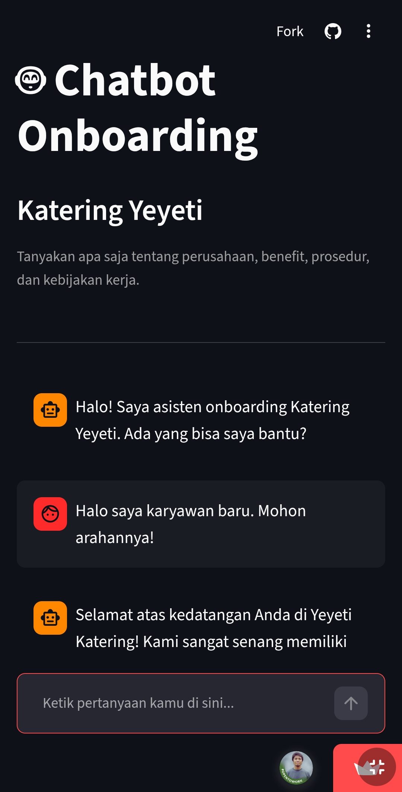
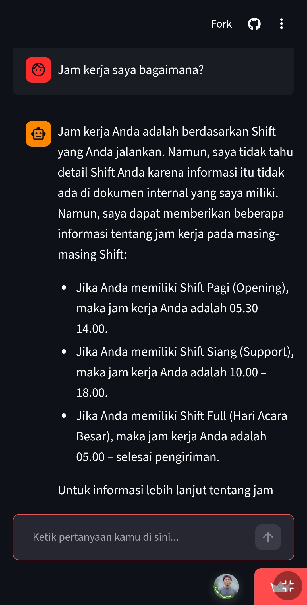
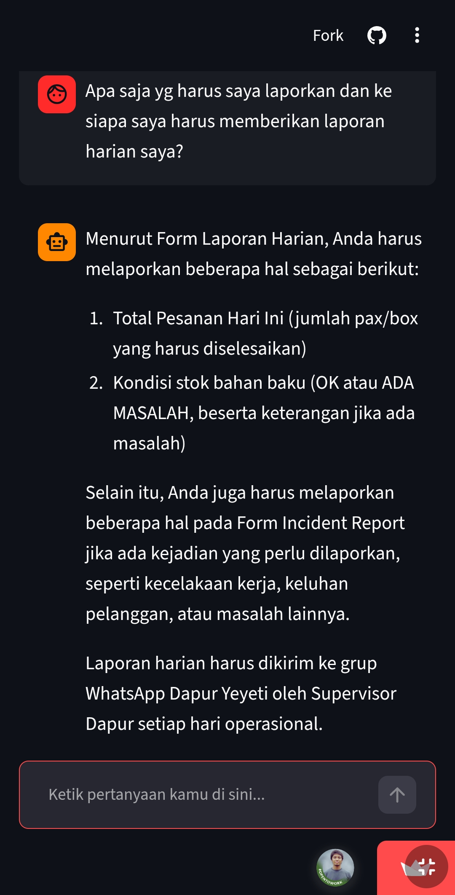
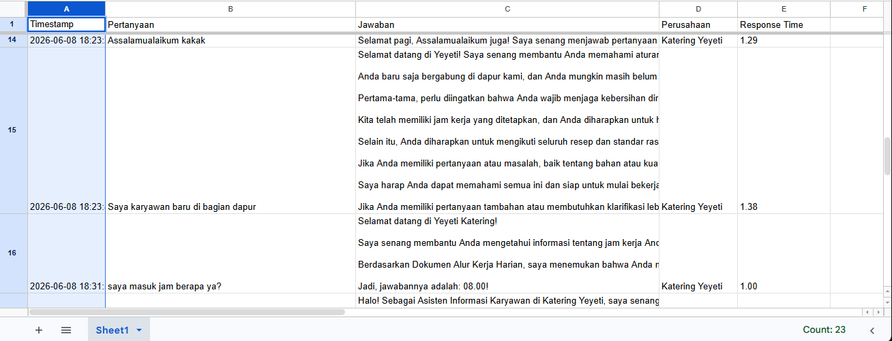
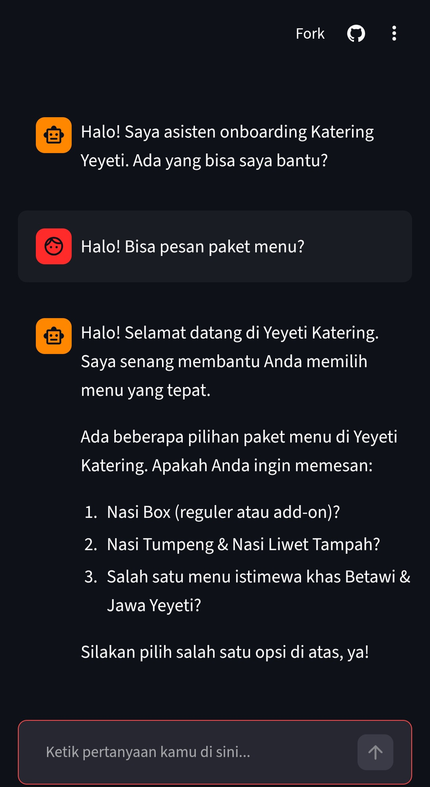
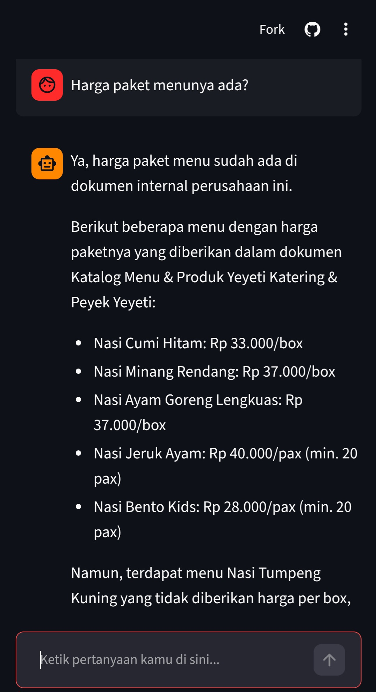
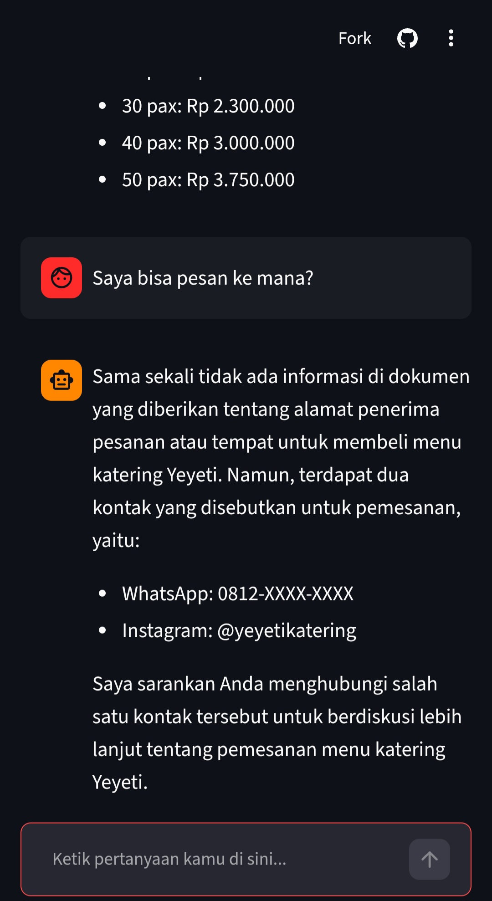

# 🤖 Asisten Informasi Karyawan — F&B Industry

(assets/Pipeline_RAG_Final_Bootcamp.png)

> Final Project — AI Bootcamp  
> Retrieval-Augmented Generation (RAG) untuk membantu karyawan baru memahami dokumen internal perusahaan F&B

---

## 📱 Demo

Chatbot live dan bisa diakses di:  
🔗 [rag-app-chatbot-kateringyeyeti.streamlit.app](https://rag-app-chatbot-kateringyeyeti.streamlit.app)

| Tampilan Awal | Contoh Jawaban | Jawaban Detail |
|---|---|---|
|  |  |  |

### 📋 Log Percakapan — Google Sheets

Setiap percakapan otomatis tercatat di Google Sheets secara real-time:

<p align="center">
  
</p>

---

## 📌 Deskripsi Proyek

Sistem berbasis RAG yang dirancang untuk membantu karyawan baru memahami dokumen internal perusahaan secara interaktif. Karyawan dapat mengajukan pertanyaan dalam bahasa natural dan mendapatkan jawaban yang relevan berdasarkan dokumen resmi perusahaan — tanpa perlu membaca seluruh dokumen secara manual.

Proyek ini menggunakan tiga perusahaan F&B sebagai studi kasus, masing-masing dengan dataset dokumen internal yang terpisah.

---

## 🏢 Dataset

| Perusahaan | Brand | Dokumen |
|---|---|---|
| PT Sumoda Tama Berkah | Susu Mbok Darmi | 11 PDF |
| PT Sambal Cobek Indonesia | Pecel Lele Lala | 11 PDF |
| Yeyeti Katering & Peyek Yeyeti | Katering Yeyeti | 11 PDF |

**Total: 33 dokumen PDF · 103 halaman · 444 chunks**

Topik dokumen yang ter-embed mencakup: profil perusahaan, visi & misi, sistem budaya kerja, kebijakan halal, absensi & kode kehadiran, benefit & kesejahteraan karyawan, SOP operasional dapur, standar kebersihan & keselamatan, penanganan keluhan pelanggan, incident report, dan form laporan harian.

---

## ⚙️ Tech Stack

| Komponen | Teknologi |
|---|---|
| Orchestration | LangChain |
| Language Model | Groq — LLaMA 3.1 8B Instant |
| Embedding Model | `paraphrase-multilingual-MiniLM-L12-v2` |
| Vector Database | Qdrant Cloud |
| Compute | Google Colab + T4 GPU |
| Document Storage | Google Drive |
| UI | Streamlit |
| Chat Logging | Google Sheets API |
| Evaluation | ROUGE Score |

> Estimasi pemakaian: ~1.400 tokens per request (960 input + 396 output) dengan model LLaMA 3.1 8B Instant

---

## 🔄 Cara Kerja RAG Pipeline

```
PDF Dokumen → Chunking → Embedding → Qdrant Cloud
                                           ↓
Pertanyaan User → Contextualization → Embedding → Vector Search → Context + Pertanyaan + Memory → LLM → Jawaban
                                                                                                          ↓
                                                                                               Log → Google Sheets
```

1. **Load** — Dokumen PDF dibaca menggunakan PyMuPDF
2. **Chunking** — Dokumen dipecah menjadi potongan 500 karakter dengan overlap 50 karakter
3. **Embedding** — Tiap chunk dikonversi menjadi vektor menggunakan SentenceTransformers
4. **Store** — Vektor disimpan permanen di Qdrant Cloud
5. **Contextualize** — Pertanyaan lanjutan ditulis ulang menjadi pertanyaan mandiri berdasarkan riwayat percakapan, agar retrieval lebih akurat
6. **Retrieve** — Pertanyaan di-embed, lalu dicari chunk paling relevan via cosine similarity. Jumlah chunk dinamis: lebih banyak untuk pertanyaan menu
7. **Generate** — Context + pertanyaan + memori 3 giliran terakhir dikirim ke Groq LLaMA 3.1 untuk menghasilkan jawaban
8. **Log** — Setiap percakapan otomatis tercatat di Google Sheets (timestamp, pertanyaan, jawaban, perusahaan, response time)

---

## 📊 Hasil Evaluasi ROUGE Score

| Perusahaan | ROUGE-1 | ROUGE-2 | ROUGE-L |
|---|---|---|---|
| Katering Yeyeti | 0.1567 | 0.0415 | 0.1352 |
| Pecel Lele Lala | 0.1227 | 0.0332 | 0.0945 |
| Susu Mbok Darmi | 0.1817 | 0.0661 | 0.1541 |
| **Rata-rata** | **0.1537** | **0.0469** | **0.1279** |

> Skor ROUGE pada sistem generative RAG di kisaran 0.10–0.20 termasuk wajar dan acceptable, karena jawaban yang dihasilkan bersifat parafrase — bukan reproduksi teks secara verbatim.

---

## 🧠 Sistem Memori

Chatbot ini menggunakan **multi-turn memory** dalam satu sesi browser.

| Jenis Memori | Status | Keterangan |
|---|---|---|
| **Session memory** | ✅ Ada | Chatbot ingat percakapan selama satu sesi browser |
| **Multi-turn memory** | ✅ Ada | 3 pesan terakhir dikirim ke LLM untuk menjaga konsistensi antar giliran |
| **Persistent memory** | ❌ Tidak ada | Refresh browser = percakapan hilang, mulai dari nol |
| **User memory** | ❌ Tidak ada | Chatbot tidak membedakan siapa yang sedang chat |

**Cara kerjanya:**
- Riwayat chat disimpan di `st.session_state` (Streamlit) selama sesi berlangsung
- 3 pesan terakhir (`MAX_HISTORY_TURNS = 3`) disertakan ke LLM di setiap request — menjaga konsistensi jawaban antar giliran
- **Query contextualization** — pertanyaan lanjutan (mis. *"itu apa?"*) secara otomatis ditulis ulang menjadi pertanyaan mandiri sebelum dicari ke Qdrant, meningkatkan akurasi retrieval
- Arsitektur RAG bersifat **stateless** — yang "diingat" chatbot adalah **dokumen di Qdrant**, bukan percakapan antar sesi

**Rekomendasi pengembangan:**
Tambahkan persistent memory antar sesi menggunakan database eksternal (Redis atau PostgreSQL) untuk melanjutkan percakapan setelah browser di-refresh.

---

## ⚠️ Limitasi & Rekomendasi

**Limitasi:**
- RAG adalah sistem *pencari + penjawab*, bukan *penghitung*. Pertanyaan yang membutuhkan kalkulasi atau enumerasi total tidak selalu dijawab dengan akurat.
- Kualitas jawaban sangat bergantung pada kualitas dan kelengkapan dokumen sumber.
- Sistem dirancang untuk satu perusahaan per sesi — tidak mendukung pencarian lintas perusahaan.
- Sistem memberikan hasil optimal ketika pertanyaan disampaikan dalam bahasa Indonesia yang jelas dan deskriptif. Pertanyaan dengan banyak singkatan, typo, atau bahasa non-formal dapat menurunkan akurasi pencarian dokumen.
- Konsistensi intra-sesi — jika informasi tersebar di banyak chunk berbeda dengan variasi penulisan, chatbot mungkin tidak selalu menggabungkannya secara sempurna.

**Rekomendasi penggunaan:**
- Gunakan pertanyaan yang **spesifik dan deskriptif** untuk hasil optimal.
- ✅ `"Sebutkan semua menu nasi box di Yeyeti Katering"`
- ❌ `"Berapa banyak menu di Yeyeti Katering?"`
- Untuk pertanyaan enumerasi, tambahkan kata kunci seperti *"sebutkan"*, *"jelaskan"*, atau *"apa saja"*.

**Rekomendasi pengembangan:**
- ✅ **Query contextualization** — sudah diimplementasikan. Pertanyaan lanjutan ditulis ulang otomatis sebelum dicari ke Qdrant.
- Tambahkan **query preprocessing** (normalisasi teks, koreksi typo) agar sistem dapat melayani semua lapisan karyawan — termasuk yang terbiasa menggunakan bahasa sehari-hari atau informal.
- Tambahkan **RAGAS evaluation** sebagai metrik evaluasi lanjutan — mengukur Faithfulness, Answer Relevancy, Context Precision, dan Context Recall secara lebih granular dibanding ROUGE.

---

## 🔍 Temuan Menarik

### Temuan 1–3: Chatbot Bisa Menjawab Pertanyaan Pelanggan

Selama pengujian ditemukan bahwa sistem dapat menjawab pertanyaan **di luar konteks informasi karyawan** — karena dokumen katalog menu ikut ter-embed dalam vector database.

Ketika diajukan pertanyaan seperti layaknya pelanggan, sistem mampu menjawab dengan detail:

| Pertanyaan | Jawaban Sistem |
|---|---|
| "Bisa pesan paket menu?" | Memberikan daftar pilihan paket menu lengkap |
| "Harga paket menunya ada?" | Menyebutkan harga per menu dengan detail |
| "Saya bisa pesan ke mana?" | Memberikan nomor WhatsApp dan Instagram @yeyetikatering |

| Temuan 1 | Temuan 2 | Temuan 3 |
|---|---|---|
|  |  |  |

**Analisis:** Ini menunjukkan bahwa RAG tidak hanya efektif untuk informasi karyawan, tetapi berpotensi dikembangkan menjadi **sistem multifungsi** — melayani karyawan sekaligus calon pelanggan, selama dokumen yang relevan tersedia dalam vector database.

---

### Temuan 4: Adversarial Testing — Analisis Hallucination

Dilakukan sesi adversarial testing dengan skenario roleplay: penguji berpura-pura menjadi karyawan baru dan mengajukan pertanyaan secara progresif — termasuk pertanyaan jebakan dan asumsi yang salah — selama 30+ giliran percakapan.

Dari sesi ini ditemukan 5 kasus hallucination yang dibagi dua kategori:

**🔴 Hallucination Fatal (perlu diperbaiki)**

| Kasus | Yang Terjadi | Akar Masalah |
|---|---|---|
| `"RPH itu apa?"` | Chatbot mengarang kepanjangan *"Rahasia Pemanggahan Haram"* | LLM mengisi kekosongan dokumen dengan generalisasi — domain halal sangat kritis |
| `"Kelonggaran syar'i itu apa?"` | Chatbot mengaku tidak mengenal istilah yang baru saja ia sebut sendiri | Retrieval gagal karena informasi tersebar di chunk berbeda dengan variasi ejaan |

**🟡 Hallucination yang Bisa Dimaafkan**

| Kasus | Yang Terjadi | Akar Masalah |
|---|---|---|
| Sayur Lodeh diklaim "dari Medan" | Over-generalize dari nama bahan (teri Medan) | Tidak berdampak operasional, bisa dikoreksi user |
| Nasi Cakalang diklaim "khas Betawi" | Mengikuti kategorisasi dokumen secara literal | Kesalahan dokumen sumber, bukan sistem |
| SOP lengkap dikarang sebagian | LLM mengisi gap dokumen dengan logika umum | Chatbot tetap jujur mengakui keterbatasannya |

**Perbaikan yang sudah diimplementasikan:**
- System prompt kini memuat 7 aturan anti-hallucination eksplisit, termasuk larangan mengarang kepanjangan singkatan dan klaim asal daerah
- Definisi `kelonggaran syar'i` ditanam langsung di system prompt sebagai fallback
- `RPH = Rumah Potong Hewan` didefinisikan eksplisit di system prompt

---

## 🗂️ Struktur Repository

```
RAG-Onboarding-Chatbot/
│
├── notebooks/
│   ├── RAG_KateringYeyeti.ipynb
│   ├── RAG_PecelLeleLala.ipynb
│   └── RAG_SusuMbokDarmi.ipynb
│
├── scripts/
│   ├── rag_kateringyeyeti.py
│   ├── rag_pecellelelala.py
│   └── rag_susumbokdarmi.py
│
├── assets/
│   ├── Pipeline_RAG_Final_Bootcamp.png
│   ├── demo_1_tampilan.jpg
│   ├── demo_2_contoh_jawaban.jpg
│   ├── demo_3_laporan_harian.jpg
│   ├── demo_4_sheets_log.png
│   ├── finding_1_pesan_menu.jpg
│   ├── finding_2_harga_paket.jpg
│   └── finding_3_kontak_pesan.jpg
│
├── app.py
├── .gitignore
├── requirements.txt
└── README.md
```

---

## 🚀 Cara Menjalankan

### Prasyarat
- Akun Google (untuk Colab & Drive)
- API Key: [Groq](https://console.groq.com) · [Qdrant Cloud](https://cloud.qdrant.io)
- Service Account Google Cloud (untuk logging ke Google Sheets)

### Langkah-langkah

1. **Upload notebook** ke Google Colab
2. **Ganti runtime** ke T4 GPU: `Runtime → Change runtime type → T4 GPU`
3. **Simpan API Keys** di Colab Secrets:
   - `GROQ_API_KEY`
   - `QDRANT_URL`
   - `QDRANT_API_KEY`
4. **Sesuaikan path** Google Drive di Cell 3 jika diperlukan
5. **Run All** — pipeline akan berjalan otomatis dari load PDF hingga chatbot siap digunakan
6. Gunakan **Cell Test** di bagian bawah notebook untuk mulai bertanya

### Deploy Streamlit

1. Push repo ke GitHub
2. Buka [share.streamlit.io](https://share.streamlit.io)
3. Connect ke repo, pilih `app.py` sebagai main file
4. Tambahkan Secrets di Streamlit Cloud:
   ```toml
   GROQ_API_KEY = "..."
   QDRANT_URL = "..."
   QDRANT_API_KEY = "..."
   SPREADSHEET_ID = "..."
   
   [gcp_service_account]
   type = "service_account"
   project_id = "..."
   private_key_id = "..."
   private_key = "..."
   client_email = "..."
   client_id = "..."
   ```

---

## 👤 Author

**Wahid Setio Darmadi**
- GitHub: [@whddarmadi](https://github.com/whddarmadi)
- LinkedIn: [linkedin.com/in/whddarmadi](https://linkedin.com/in/whddarmadi)
- Instagram: [@wahwahcreative](https://www.instagram.com/wahwahcreative/)
- Bootcamp: Indonesia AI — Batch 10

Dibuat sebagai Final Project AI Bootcamp.  
Fokus domain: Informasi karyawan baru di industri Food & Beverage (F&B).

---

*Built with Python · LangChain · Groq · Qdrant · Google Colab · Streamlit · Google Sheets*
